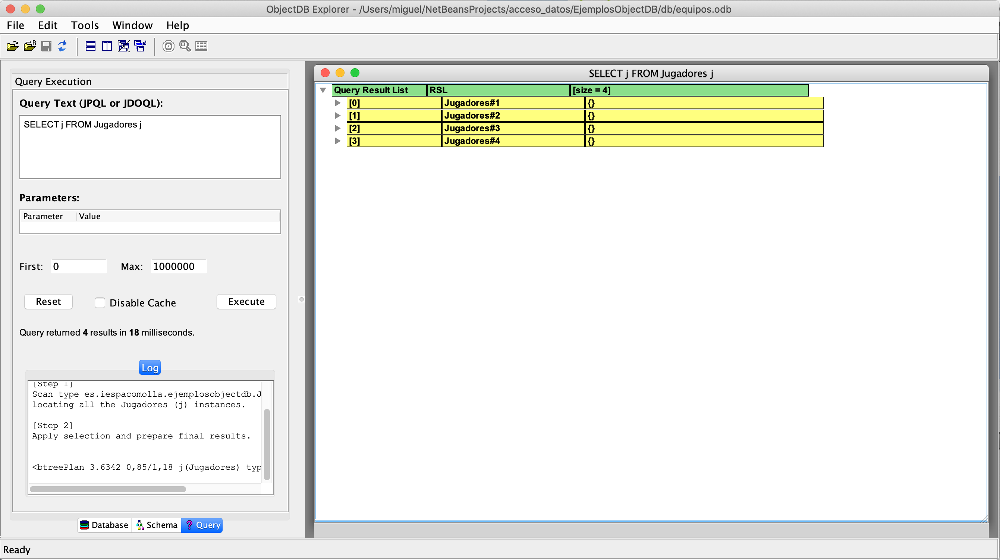

# 	Bases de datos orientadas a objetos. ObjectDB

Las bases de datos orientadas a objetos permiten no tener que realizar la conversión objeto-relacional si trabajamos con las tradicionales bases de datos relacionales o el en ocasiones tedioso proceso de mapeo que exige la utilización de una herramienta ORM. 

ObjectDB, es una base de datos orientada a objetos que se basa en la capa de persistencia de Java JPA (*Java Persistence API*) que ofrece la posibilidad de implementar un almacen de datos de forma sencilla y que tiene un rendimiento aceptable para aplicaciones no muy grandes. Esta base de datos ofrece el almacenado y recuperación de información, la gestión de transacciones y bloqueo de recurso, además de un lenguaje de consultas muy parecido a SQL.

## Utilización de ObjectDB en nuestros proyectos

Para poder utilizar ObjectDB en nuestros proyectos, podemos descargar los ficheros binarios que están disponibles en la página web del proyecto.

[Descargar binarios de ObjectDB](https://www.objectdb.com/download) 

También, podemos utilizar Maven para añadir de forma automática las dependencias desde el repositorio de oficial.

```xml
<repositories>	
  <repository>
    <id>objectdb</id>
    <name>ObjectDB Repository</name>
    <url>https://m2.objectdb.com</url>
  </repository>
</repositories>
```

Donde, en el fichero pom.xml añadiremos la siguiente dependencia.

```xml
<dependencies>
        <dependency>
            <groupId>com.objectdb</groupId>
            <artifactId>objectdb</artifactId>
            <version>2.8.3</version>
        </dependency>
        <dependency>
            <groupId>org.eclipse.persistence</groupId>
            <artifactId>javax.persistence</artifactId>
            <version>2.1.0</version>
        </dependency>
        <dependency>
            <groupId>javax.transaction</groupId>
            <artifactId>jta</artifactId>
            <version>1.1</version>
        </dependency>
    </dependencies>
```

Cabe destacar que en la página oficial de ObjectDB existen una serie de herramientas complementarias que pueden ser de ayuda durante el desarrollo de nuestros proyectos, como por ejemplo el explorer.jar que nos permite explorar el contenido de la base de datos y probar nuestras consultas.



## Definición de Entidades en ObjectDB

ObjectDB utiliza la definición de clases básicas de Java POJO's (*Pain Old Java Object*) con una serie de anotaciones para configurar el modo en que las instancias de estas se almacenan en la base de datos. Estas clases a las que ObjectDb se refiere como **Entity** representa toda aquella clase que no sea compuesta y que sea candidata a ser almacenada en la base de datos 

```java
@Entity
public class Equipo {
    
    @Id
    private int id;
    private String nombre;
    private String ciudad;
    private String division;
    private String conferencia;
    @OneToOne(cascade=CascadeType.All)
    private Entrenador entrenador;
    @OneToMany(cascade={CascadeType.PERSIST,CascadeType.REFRESH})
    private Set<Jugador> jugadores;
    
    //Constructores y métodos setters y getters                    
                        
 }  
```

Por defecto, en ObjectDB toda propiedad de una clase se considera persistente, es decir, será almacenada en la base de datos. A esta regla tenemos una serie de excepciones como aquellas propiedades definidas como *final*, *transient* o *static* que no se persistirán en la base de datos.

## Claves primarias en ObjectDB

Por defecto, ObjectDB crea un identificador único para cada instancia de cada objeto, no obstante, es recomendable definir un campo que podamos comprobar para almacenar un campo a partir del cual podamos identificar estas instancias de forma unequivoca.

Este campo puede ser de uno de los tipos siguientes:

* Tipos primitivos: boolean, byte, short, char, int, long, float, double.
* Clases equivalentes que actuan como envoltura del paquete java.lang como Byte, Short, Character, Integer, Long, Float, Double.
* java.math.BigInteger, java.math.BigDecimal.
* java.lang.String.
* java.util.Date, java.sql.Date, java.sql.Time, java.sql.Timestamp.
* Cualquier tipo enum.
* Referencias a otros objectos marcados con la eqtiqueta @Entity

Dentro de la definición más común de una clave primaria, podemos utilizar un campo definido dentro de nuestra clase, como tendríamos en el siguiente ejemplo:

```java
@Entity
public class Lesion {
  @Id
  private int id;
  private String nombre;
  private int tiempo_rec;
  @ManyToMany(cascade={CascadeType.PERSIST,CascadeType.REFRESH})
  private Set<Jugador> lesionados;
  
  //Constructores y métodos setters y getters
}
```

También podemos optar por que la propia base de datos nos genere de forma automática el campo que utilizaremos como identificador y tendremos que definir este con la etiqueta @GeneratedValue

```java
@Entity
public class Entrenador {
  @Id @GeneratedValue
  private int id;
  private String nombre;
  private int edad;

  //@OneToOne(cascade={CascadeType.PERSIST,CascadeType.REFRESH})
  private Equipo equipo;
}
```

Un caso especial es si queremos definir una clave compuesta por múltiples campos. Para ello podemos definir una clase adicional que incrustaremos en nuestra clase principal y que contendrá aquellos campos que forman la clave primaria múltiple.

```java
@Entity
public class Jugador {
  @EmbeddedId
  private JugadorId id_jugador;
  private Double altura;
  private int peso;
  //Constructores y métodos setters y getters
}
@Embeddable
public class JugadorId{
  int posicion;
  String nombre;
  //Constructores y métodos setters y getters 
}
```

## Conexión a la base de datos con ObjectDB

Para realizar una conexión a la base de datos, bien sea utilizando está de forma embebida o en modo servidor, utilizaremos las interfaces *EntityManagerFactory* y *EntityManager* 

### Crear la conexión con la base de datos

```java
EntityManagerFactory emf =
      Persistence.createEntityManagerFactory("objectdb:db/nba.odb");
EntityManager em = emf.createEntityManager();
```

En este creamos una base de datos embebida llamada *nba.odb* que está dentro de la carpeta *db* del directorio raíz de nuestro proyecto.

Si utilizamos la base de datos en modo servidor podemos especificar la dirección de red en la url de conexión,

```java
EntityManagerFactory emf = Persistence.createEntityManagerFactory(
      "objectdb://localhost/nba.odb;user=admin;password=admin");
EntityManager em = emf.createEntityManager();
```

### Cerrar la conexión a la base de datos

Cuando terminemos de realizar las operaciones pertinentes con la base de datos, los componentes definidos para realizar la conexión deben ser cerrados de forma apropiada con los siguientes métodos de las clases *EntityManagerFactory* y *EntityManager*.

```java
em.close();
emf.close();
```

## Transacciones en la base de datos

Cualquier cambio que se produzca en la base de datos tiene que ser realizado creando una transacción y dando el visto bueno a la misma con una operación de *commit* o desestimándola con una operación de *rollback*. En el siguiente ejemplo, se muestran los métodos proporcionados por la interfaz *EntityManager* para gestionar las transacciones.

```java
try {
      em.getTransaction().begin();
      // Operaciones que modifican la base de datos
      em.getTransaction().commit();
  }
  finally {
      if (em.getTransaction().isActive())
          em.getTransaction().rollback();
  }
```

## Operaciones fundamentales (CRUD) en ObjectDB

Para realizar las operaciones de inserción, lectura, modificación y borrado debemos utilizar los métodos que ofrece la interfaz *EntityManager*, los siguientes ejemplos muestran como realizar dichas operaciones. Hay que notar que toda operación que realice una modificación de la base de datos deberá implicar una transacción para que estos datos se reflejen en la base de datos.

### Insertar un elemento en la base de datos

Para persistir un elemento recién creado en la base de datos utilizamos el método *persist()* para almacenar la instancia del una clase en la base de datos. En los ejemplos anteriores se ha mostrado dos tipos de clases, la clase *Jugador* que contiene una instancia de la clase JugadorId de forma Embebida y la clase Lesión que tiene una agregación con la clase Jugador tal cual se puede observar en la siguiente definición.

```java
@Entity
public class Jugador {
  @EmbeddedId
  private JugadorId id_jugador;
  private Double altura;
  private int peso;
  //Constructores y métodos setters y getters
}
@Embeddable
public class JugadorId{
  int posicion;
  String nombre;
  //Constructores y métodos setters y getters 
}

@Entity
public class Lesion {
  @Id
  private int id;
  private String nombre;
  private int tiempo_rec;
  @ManyToMany(cascade={CascadeType.PERSIST,CascadeType.REFRESH})
  private Set<Jugador> lesionados;
  
  //Constructores y métodos setters y getters
}
```

En cuanto a la clase Jugador podemos almacenar la clase compuesta JugadorId, sin tener que definir ninguna etiqueta adicional, pues la clase JugadorId forma parte de la clase Jugador al ser está declarada com @Embeddable. Así, si guardamos un elemento de la clase Jugador, almacenaremos de forma automáticamente un elemento de la clase JugadorId.

```java
JugadorId id = new JugadorId(1,'Stephen Curry');
Jugador jug = new Jugador(id,1.97,98);

em.getTransaction.begin();
em.persist(jug);
em.getTransaction.commit();
```

En la persistencia de la clase Lesión, tenemos que tener en cuenta que existe una agregación entre esta clase y la clase Jugador a través del atributo *lesionados* que es de tipo Set\<Jugador>.

```java
JugadorId id = new JugadorId(1,'Stephen Curry');
Jugador jug = new Jugador(id,1.97,98);
Set<Jugador> les = new HashSet<Jugador>();
les.add(jug);

Lesion lesion = new Lesion(1,'Triada',15, les);

em.getTransaction.begin();
em.persist(les);
em.getTransaction.commit();
```

En este caso como durante la definición de la relación @ManyToMany hemos establecido un tipo de cascada para las operaciones de *CascadeType.PERSIST* la operación de inserción de una lesión también llevará asociado una inserción de los jugadores que estén dentro del Set asociado a lesión. En caso de no definir este tipo de cascada, habría que realizar primero la inserción de la instancia del jugador antes de poder asociarla a la lesión o de lo contrario obtendremos una excepción IllegalStateException.

### Recuperar un objeto almacenado en la base de datos

Para recuperar un objetos que tengamos almacenado en la base de datos, tenemos dos opciones. Por una parte, utilizar el método *find()* para recuperar una instancia a través de su campo identificador, por otra, podemos utilizar una consulta JPQL para recuperar la instancia que deseamos con una sintaxis similar a SQL. A modo de ejemplo, la recuperación del objeto almacenado en el apartado anterior sería como se muestra en el ejemplo siguiente.

```java
Jugador jugadorRecuperado = em.find(Jugador.class, 1);
```

En este caso al recuperar una instancia de la clase Jugador obtendríamos también una instancia de la clase JugadorId, al estar compuesta de la misma y ser una clase @Embeddable. 

En el caso de recuperar una instancia de la clase Lesión como tenemos una asociación con la clase Jugador en forma de un Set\<Jugador> se recuperará de la base de datos los jugadores que componen este Set cuando se haga referencia a ellos. Si queremos que estos Jugadores se recuperen independientemente de si han sido referenciados o no tendremos que definir unn atributo en la definición de la relación entre estas dos clases tal y como se muestra en el ejemplo anterior.

```java
@Entity
public class Lesion {
  @Id
  private int id;
  private String nombre;
  private int tiempo_rec;
  @ManyToMany(cascade={CascadeType.PERSIST,CascadeType.REFRESH}, fetch=FetchType.EAGER)
  private Set<Jugador> lesionados;

  //Constructores y métodos setters y getters
}
```

El segundo de los métodos nos permite recuperar información de la base de datos utiizando sentencias de sintaxis muy similar a SQL pero trabajando con Objetos en lugar de Tablas de la base de datos. Así podemos recuperar información como en el siguiente ejemplo.

```java
TypedQuery<Jugador> query = em.createQuery("SELECT j FROM Jugador j WHERE nombre='Stephen Curry'", Jugador.class);
```

La ejecución de la consulta puede obtenerse con los métodos *getSingleResult()* cuando esperemos obtener un solo resultado o *getResultList()* si puede devolver múltiples resultados.

```java
List<Jugador> resultadoMultiple = query.getResultList();

Jugador jug = query.getSingleResult();
```

### Modificar una instancia ya almacenada en la base de datos

Cuando recuperamos una instancia ya persistida en la base de datos, cualquier modificación que realicemos sobre está con una transacción activa persistirá las modificaciones realizadas de forma automática. Así el siguiente código modificaría el objeto Jugador que hemos obtenido de la base de datos.

```java
Jugador jugadorRecuperado = em.find(Jugador.class, 1);

em.getTransaction.begin();

jugadorRecuperado.setPeso(jugadorRecuperado.getPeso()+10);

em.getTransaction.commit();
```

Está actualización se puede indicar de forma explicita con el método *persist()* de la misma forma que se realiza la inserción de un objeto nuevo.

```java
Jugador jugadorRecuperado = em.find(Jugador.class, 1);
jugadorRecuperado.setPeso(jugadorRecuperado.getPeso()+10);

em.getTransaction.begin();

em.persist(jug);

em.getTransaction.commit();
```

### Borrar una instancia ya almacenada en la base de datos

Para borrar una instancia de la base de datos podemos utilizar el método *remove()* que eliminará la referencia a la instancia del objeto. Tal y como se muestra en el siguiente ejemplo.

```java
Jugador jugadorRecuperado = em.find(Jugador.class, 1);

em.getTransaction.begin();

em.remove(jug);

em.getTransaction.commit();
```

En este caso tenemos que tener especial cuidado por como se haya definido el tipo operaciones que se realizarán en cascada, pues pueden producir borrados inesperados. Así, si en el ejemplo anterior cuando definimos la clase Lesión establecemos la operación *CascadeType.REMOVE* o CascadeType.ALL, el borrado de una lesión provocará el borrado de los Jugadores asociados a la misma dentro del Set\<Jugador>

```java
@Entity
public class Lesion {
  @Id
  private int id;
  private String nombre;
  private int tiempo_rec;
  @ManyToMany(cascade=CascadeType.ALL, fetch=FetchType.EAGER)
  private Set<Jugador> lesionados;

  //Constructores y métodos setters y getters
}
```

## Consultas JPQL en ObjectDB

ObjectDB ofrece un lenguaje de consultas muy similar a SQL que permite interrogar a la base de datos con bastante facilidad. También dispone de la interfaz *CriteriaQuery* que permite realizar las mismas operaciones utilizando una serie de métodos que permiten definir las opciones de filtrado. Este último método de consulta ofrece una forma de trabajo mucho más enrevesada y por ello nos centraremos en el lenguaje JPQL que permite recuperar la información de forma más intuitiva.

### La estructura de una consulta JPQL

La estructura de una consulta JPQL es identica a la estructura de SQL con los siguientes apartados.

```sql
SELECT ... FROM ...
[WHERE ...]
[GROUP BY ... [HAVING ...]]
[ORDER BY ...]
```

También se ofrece la posibilidad de realizar operaciones de borrado y actualización de múltiples instancias con sentencias del tipo.

```sql
DELETE FROM ... [WHERE ...]

UPDATE ... SET ... [WHERE ...]
```

Hay que recordar que trabajamos con instancias de objetos, por lo que se deben mantener los nombres de las clases y los atributos definidas en estas.

### Consultas JPQL sencillas

A continuación, se muestran una serie de ejemplos que permiten observar aquellas consultas que son más comunmente utilizadas.

* Recuperar todos los jugadores almacenados en la base de datos

```sql
SELECT j FROM Jugador j
```

* Recuperar un jugador de la base de datos que tomando como criterio de filtrado su nombre. Se utilizan comillas simples para definir el criterio de filtrado, pues normalmente la sentencia JPQL se define como un String dentro del método ` em.createQuery("SELECT ...")`

```sql
SELECT j FROM Jugador j WHERE j.nombre='Stephen Curry'
```

* Podemos seleccionar diversos atributos de una clase en lugar de obtener la instancia completa. En este caso al ejecutar una consulta, obtendremos un array de objetos (Object[]) donde tendremos los atributos de la clase con el mismo orden que hemos establecido en la sentencia SELECT.
* 

```java
TypedQuery<Object[]> q = em.createQuery("SELECT j.peso, j.altura FROM Jugador j WHERE j.nombre='Stephen Curry'", Object[].class);

Object[] resultado = q.getResultList();

System.out.println("Stephen Curry pesa: "+resultado[0] + " y mide: "+resultado[1]);

```

### Consultas con parámetros 

Tenemos dos opciones para crear consultas con parámetros que obtengamos de una interfaz o que obtengamos a través de una línea de comandos. Podemos establecer estos parámetros en nuestras consultas por una etiqueta que luego referenciaremos o por el orden del parámetro.

```java
TypedQuery<Object[]> q = em.createQuery("SELECT j.peso, j.altura FROM Jugador j WHERE j.nombre=:parametroNombre", Object[].class);
q.setParameter("parametroNombre", "Stephen Curry");
```

También podemos realizar estos parámetros identificándolos de forma ordinal, por la posición que ocupan dentro de la sentencia.

```java
TypedQuery<Jugador> q = em.createQuery("SELECT j FROM Jugador j WHERE j.peso=?1 AND j.altura=?2", Object[].class);
q.setParameter(1, 1.97);
q.setParameter(2. 98);
```

### Consultas con funciones de agregado

JPQL soporta las siguientes funciones de agregado que podemos utilizar para obtener cálculos sobre los resultados de una consulta. Las siguientes funciones de agregado son soportadas en este lenguaje.

- **`COUNT`** - retorna un long que representa el número de elementos.
- **`SUM`** - retorna la suma de los valores del campo que obtiene por parámetro.
- **`AVG`** - retorna la media de los valores como un double.
- **`MIN`** - retorna el minimo de los valores que puedan compararse (numéricos, strings, fechas).
- **`MAX`** - retorna el minimo de los valores que puedan compararse (numéricos, strings, fechas).

```java
TypedQuery<Double> q = em.createQuery("SELECT avg(j.peso) FROM Jugador j", Double.class);
```

### Consultas con Group By

Adicionalmente a las funciones de agregado, podemos utilizar el modificador GROUP BY para agrupar los resultados de las consultas y adicionalmente con la cláusula HAVING filtrar por los mismos.

```sql
SELECT j.id_jugador.posicion, AVG(j.peso) FROM Jugador j GROUP BY j.id_jugador.posicion HAVING avg(j.peso>100);
```

En el ejemplo anterior obtendríamos la posición y el peso medio de los jugadores agrupados por posición siempre y cuando el peso medio de todos los jugadores de esa posición fuera superior a 100kg.

### Consultas con acceso a atributos compuestos

Cuando definimos la estructura podemos definir campos no sean datos básicos y que sean instancias de otras clases. De este modo el lenguaje introduce una serie de modificaciones sobre sql que permiten acceder a esos datos compuestos. 

Si recordamos la definición de jugador tenemos un campo id_jugador del tipo Jugador_Id que está compuesto por dos atributos y el @Embeddable

```java
public class Jugador {
  @EmbeddedId
  private JugadorId id_jugador;
  private Double altura;
  private int peso;
  //Constructores y métodos setters y getters
}
@Embeddable
public class JugadorId{
  int posicion;
  String nombre;
  //Constructores y métodos setters y getters 
}
```

```sql
SELECT j FROM Jugador j WHERE j.id_jugador.posicion=1
```

En la sentencia anterior utilizamos la notación con un punto para acceder al atributo compuesto que tiene la clase Jugador y dentro de este a la propiedad posición para generar nuestra consulta.

### Consultas con acceso a colecciones

Otra de las particularidades que tenemos al trabajar con objetos es la posibilidad de tener colecciones de otros objetos que representen una agregación entre clases. Así, en el ejemplo anterior, la clase Lesión obtiene una colección (Set\<Jugador> ) de jugadores.

```java
@Entity
public class Lesion {
  @Id
  private int id;
  private String nombre;
  private int tiempo_rec;
  @ManyToMany(cascade={CascadeType.PERSIST,CascadeType.REFRESH}, fetch=FetchType.EAGER)
  private Set<Jugador> lesionados;

  //Constructores y métodos setters y getters
}
```

En el siguente ejemplo se observa como acceder a una colección de objetos de Jugador que contiene la clase Lesion.

```java
Jugador jug = em.find(Jugador.class,1);

TypedQuery<Lesion> query = em.createQuery("SELECT l FROM Lesion l WHERE :parametroJugador IN l.lesionados");
//La consulta siguiente con el modificador MEMBER OF es equivalente
//TypedQuery<Lesion> query = em.createQuery("SELECT l FROM Lesion l WHERE :parametroJugador MEMBER OF l.lesionados");
query.setParameter(parametroJugador,jug);


List<Jugador> lesionesDeUnJugador = query.getResultList();
```

Otros ejemplos de sentencias JPQL con funciones que permiten trabajar con colecciones son la siguientes:

```sql
SELECT l FROM Lesion l WHERE l.lesionados IS EMPTY
```

Aquellas lesiones que no tengan ningún jugador asociado.

```sql
SELECT l FROM Lesion l WHERE SIZE(l.lesionados)>2
```

Aquellas lesiones que tengan más de dos jugadores asociados.